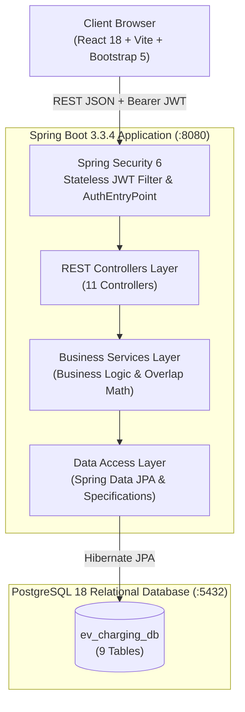

# VoltPoint EV - Charging Station Management & Booking Platform


A production-style full-stack academic engineering mini-project built for **2nd Year Computer Engineering / Semester 3** (Java & Relational Database Technologies).

The platform addresses EV driver range anxiety and charging unpredictability by providing an end-to-end digital solution: **DISCOVER → RESERVE → CHARGE → PAY → TRACK**.

---

## ⚡ Core Features

- **Station Discovery & Port Filtering:** Search and filter stations across Mumbai & Navi Mumbai by city, connector standard (CCS2, Type 2, CHAdeMO), and charger speed (DC Fast 50-120kW vs AC Standard 7.4-22kW).
- **Slot Reservation & Double-Booking Prevention:** Lock charger ports in advance. The backend algorithm mathematically checks time interval overlaps to reject conflicting reservations with `409 Conflict`.
- **Live Hardware Simulation & Telemetry Hub:** Real-time charging simulation displaying battery state-of-charge (SoC %), delivered kWh, current charging rate (kW), and elapsed duration. Includes an interactive **Fast-Forward (+5m, +15m, +30m)** simulator tool for viva evaluation.
- **GST-Compliant Digital Invoicing:** Automatically generates tax invoices with 18% GST (9% CGST + 9% SGST) upon session completion.
- **Simulated Payment Gateway:** Settle invoices via mock UPI (QR Code / VPA), Credit/Debit Card, or EV Pre-paid Wallet with verified transaction reference IDs.
- **Multi-Role Dashboards:**
  - **EV Driver (Customer):** View upcoming reservations, live active session telemetry, garage management (add EV models with presets), and carbon footprint tracker ($\text{CO}_2$ offset).
  - **Station Operator:** Manage assigned station hardware, override charger statuses (`AVAILABLE`, `MAINTENANCE`, `OCCUPIED`), add new charger ports, and track today's energy delivered and revenue.
  - **System Administrator:** System-wide metrics, deploy new charging hubs, audit user accounts, and review network transaction audit logs.
- **1-Click Demo Switcher:** Switch between Customer, Operator, and Admin roles directly from the navigation bar or login screen without manual typing.

---

## 🏛️ System Architecture



---

## 🔑 Pre-Seeded Demo Credentials

All test accounts use the password: `password123`

| Role | Email | Password | Intended Workflow |
|---|---|---|---|
| **EV Customer** | `customer@evhub.in` | `password123` | Discover stations, book slots, monitor live charging, simulate fast-forward, pay bills |
| **Station Operator** | `operator@evhub.in` | `password123` | Manage station ports, toggle Maintenance/Available, add new chargers |
| **Super Admin** | `admin@evhub.in` | `password123` | Deploy new stations, manage user permissions, monitor platform revenue |

*(Tip: You can also use the 1-click login buttons on the Login page!)*

---

## 🚀 Getting Started & Local Setup

### 1. Prerequisites
- **Java Development Kit (JDK):** Version 17, 21, or 26
- **Apache Maven:** 3.8+
- **Node.js:** 18+ and npm
- **PostgreSQL Database Server:** Version 14 to 18 running on `localhost:5432`

---

### 2. Database Setup
1. Open pgAdmin, DBeaver, or psql and create the database:
```sql
CREATE DATABASE ev_charging_db;
```
2. Check your credentials in `backend/src/main/resources/application.properties`:
```properties
spring.datasource.url=jdbc:postgresql://localhost:5432/ev_charging_db
spring.datasource.username=postgres
spring.datasource.password=Marvaj
```
*(Update the password if your local PostgreSQL password differs).*
3. When Spring Boot launches, Hibernate will automatically create the tables, and `DataInitializer.java` will seed the initial stations, chargers, users, and vehicles. (Alternative manual SQL scripts are provided in `database/schema.sql` and `database/seed.sql`).

---

### 3. Backend Setup (Spring Boot)
Open a terminal in the project root:
```bash
cd backend
mvn clean compile
mvn spring-boot:run
```
The backend will boot up at: `http://localhost:8080`  
API Base URL: `http://localhost:8080/api`

---

### 4. Frontend Setup (React 18 + Vite)
Open a separate terminal window:
```bash
cd frontend
npm install
npm run dev
```
The frontend will start at: `http://localhost:5173`

---

## 📋 Viva Voce Demonstration Walkthrough

When presenting this project to your college professor or external examiner, follow this 5-minute demonstration script:

1. **Step 1 - Login & Role Switching:**
   - Open `http://localhost:5173`.
   - Click **Sign In** and use the **1-Click Customer Login** button to authenticate as `customer@evhub.in`.
2. **Step 2 - Station Discovery & Filtering:**
   - Navigate to **Stations**.
   - Filter by City (e.g. `Mumbai` or `Navi Mumbai`) and Speed (`DC Fast`).
   - Open the **VoltPoint SuperCharge Hub - BKC** station.
3. **Step 3 - Slot Booking & Conflict Prevention:**
   - Select an available charger port (e.g. `BKC-DC-01`).
   - Select the customer's vehicle (`Tata Nexon EV Max`).
   - Adjust duration and review the dynamic price breakdown (Base + 18% GST).
   - Click **Confirm Reservation**. Explain the time interval overlap logic that prevents double-booking.
4. **Step 4 - Live Hardware Telemetry & Fast-Forward Simulator:**
   - Go to **Bookings** and click **Start Charging Now** (or navigate to **Live Hub**).
   - Show the examiners the live battery SoC gauge, delivered kWh counter, and real-time cost accumulation.
   - Click the **+15 Mins Fast-Forward** button to demonstrate how the software advances simulated charging time and battery percentage dynamically.
5. **Step 5 - Stop Charging & Tax Invoicing:**
   - Click **Stop Session & Checkout**.
   - Point out the itemized GST tax invoice with CGST (9%) and SGST (9%).
   - Select **UPI / QR Code** or **Credit Card** and click **Pay Now**.
   - Show the generated unique transaction reference (e.g., `TXN-82749102`) and click **Print Invoice**.
6. **Step 6 - Operator & Admin Portals:**
   - Use the Navbar Role Switcher to switch to **Operator** to demonstrate port status overrides (`AVAILABLE` ↔ `MAINTENANCE`).
   - Switch to **Admin** to show platform-wide revenue analytics and the station deployment wizard.

---

## 📂 Project Structure

```
EV Charging Station Project/
├── backend/
│   ├── pom.xml
│   └── src/
│       └── main/
│           ├── java/com/evcharging/
│           │   ├── config/              # DataInitializer, CorsConfig
│           │   ├── controller/          # REST Endpoints (11 Controllers)
│           │   ├── dto/                 # Request & Response DTOs
│           │   ├── entity/              # 9 JPA Entities (Standard POJOs)
│           │   ├── exception/           # Global Exception Handler
│           │   ├── repository/          # Spring Data JPA Repositories
│           │   ├── security/            # JWT Token Provider, Auth Filters
│           │   ├── service/             # Business Logic & Math Simulation
│           │   └── EvChargingApplication.java
│           └── resources/
│               └── application.properties
├── frontend/
│   ├── index.html
│   ├── package.json
│   ├── vite.config.js
│   └── src/
│       ├── api/axios.js                 # Axios instance with JWT interceptor
│       ├── components/                  # Navbar, Footer, Badges, ProtectedRoute
│       ├── context/AuthContext.jsx      # Global Authentication State
│       ├── pages/                       # 11 React Pages
│       ├── App.jsx                      # Client-side Routing
│       ├── index.css                    # Responsive EV Dark Theme styling
│       └── main.jsx
├── database/
│   ├── schema.sql                       # PostgreSQL DDL script
│   └── seed.sql                         # Initial dataset DML script
└── docs/
    ├── API_DOCUMENTATION.md             # Complete REST API specifications
    ├── ARCHITECTURE_DOCUMENTATION.md    # System diagrams & technical formulas
    └── VIVA_QUESTIONS_AND_ANSWERS.md    # 25+ Viva questions & examiner answers
```

---

## 🎓 Academic Integrity & Viva Readiness

- **Standard Java POJOs:** Built without Lombok dependencies to ensure 100% clean compilation on Oracle JDK 17, 21, and 26.
- **Monolithic Layering:** Strict separation of concerns (Controller, Service, Repository) ideal for code inspection.
- **Complete Documentation:** Includes 25+ detailed questions and answers in `docs/VIVA_QUESTIONS_AND_ANSWERS.md`.
