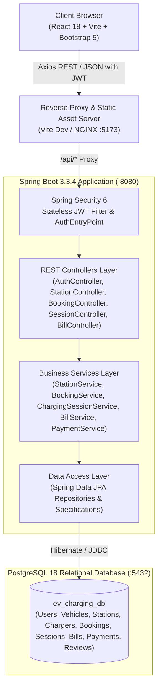
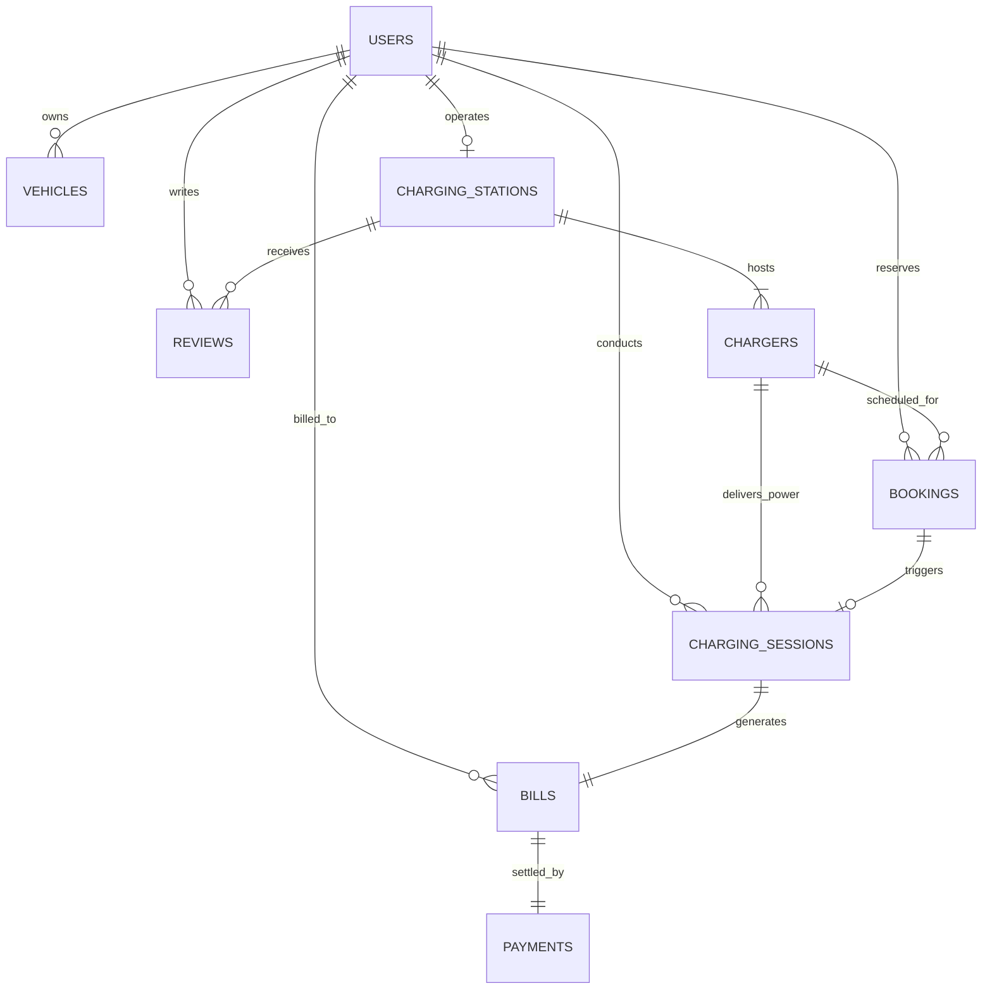

# Architecture Documentation: EV Charging Station Platform

**Academic Project:** EV Charging Station Management & Booking Platform  
**Target Level:** 2nd Year Computer Engineering / Semester 3 (Java & Database Technologies)  
**Architecture Pattern:** Monolithic 3-Tier Layered Architecture

---

## 1. High-Level Architectural Diagram



---

## 2. Entity Relationship (ER) Diagram



---

## 3. Core Business Logic & Algorithms

### 3.1 Slot Conflict & Double-Booking Overlap Prevention
To prevent two drivers from reserving the same physical charger port at the same or overlapping time windows, the system utilizes the mathematical interval overlap theorem:

Two time intervals $[S_1, E_1]$ and $[S_2, E_2]$ overlap **if and only if**:
$$\max(S_1, S_2) < \min(E_1, E_2)$$

In SQL and Spring Data JPA, this is implemented in `BookingRepository`:
```sql
SELECT COUNT(b) FROM Booking b
WHERE b.charger.id = :chargerId
  AND b.status IN ('CONFIRMED', 'PENDING')
  AND b.startTime < :newEndTime
  AND b.endTime > :newStartTime
```
If the count is greater than 0, the `BookingService` instantly rejects the request with HTTP `409 CONFLICT` and a clear descriptive error message.

---

### 3.2 Real-Time EV Hardware Telemetry Simulation
Because real EV chargers communicate over the OCPP protocol with physical chargers, our production-grade academic system simulates hardware charging dynamics accurately in software:

1. **Power Rating ($P$)**: Defined on the charger port (e.g., 60 kW DC Fast Charger).
2. **Elapsed Time ($\Delta t$)**: Expressed in hours ($\frac{\text{minutes}}{60}$).
3. **Efficiency ($\eta$)**: Real-world power delivery efficiency factor ($\approx 0.90$).
4. **Delivered Energy ($E$)**:
   $$E (\text{kWh}) = P (\text{kW}) \times \Delta t (\text{h}) \times \eta$$
5. **Battery State of Charge (SoC %)**:
   $$\Delta \text{SoC} (\%) = \left(\frac{E}{\text{Battery Capacity (kWh)}}\right) \times 100$$
   $$\text{Current SoC} = \min(100\%, \text{Initial SoC} + \Delta \text{SoC})$$
6. **Current Cost ($C$)**:
   $$C (₹) = E (\text{kWh}) \times \text{Tariff Rate (₹/kWh)}$$
7. **Fast-Forward Simulation**:
   The `/api/sessions/{id}/tick?minutes=N` endpoint allows the examiner during a viva to advance simulated vehicle charging by 5, 15, or 30 minutes without waiting in real time.

---

### 3.3 Indian GST Tax Invoice Calculation
According to standard Indian commercial taxation rules:
- **Base Energy Charge ($B$)** = $\text{Total Delivered kWh} \times \text{Tariff Rate per kWh}$
- **Central GST (CGST @ 9%)** = $B \times 0.09$
- **State GST (SGST @ 9%)** = $B \times 0.09$
- **Total Tax ($T$)** = $B \times 0.18$
- **Total Invoice Amount** = $B + T$

---

## 4. Why This Architecture? (College Viva Defense)

1. **Monolith vs Microservices:**
   - For a 2nd year project, microservices introduce unnecessary overhead (network latency, service discovery, distributed transactions, Docker orchestration).
   - A layered monolith is clean, maintainable, debuggable, fast, and 100% compliant with standard university project evaluation rubrics.
2. **Standard Java POJOs over Lombok:**
   - Compiles seamlessly across all JDK environments (Java 17, Java 21, and the newest Oracle JDK 26) without annotation processor conflicts.
3. **Stateless JWT Security:**
   - Eliminates server-side session memory consumption and supports modern Single Page Application (SPA) REST architectures.
